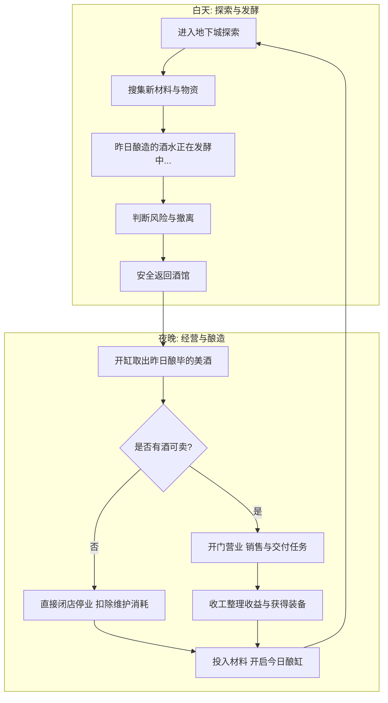

# 00 - 项目总纲

## 1. 项目基本信息
*   **项目代号**：Dungeon Tavern（暂定）
*   **游戏类型**：探索经营 Roguelike RPG
*   **核心卖点 (修订版)**：
    > 经营一家位于地下城深处的酒馆，在人类与怪物长期敌对的世界中建立自己的关系网络，并调查逐渐扩散的失序现象。
*   **核心体验**：
    *   玩家并非传统的救世主、英雄、骑士或领主。
    *   玩家的真实身份是一名在地下城边缘开酒馆的普通人类，兼任地下商贩。
    *   这个世界默认并不欢迎人类，玩家不能通过武力征服地下城，而是需要依靠经营、社交和交易在多势力交错的生态中建立自己的商业与信任网络。

---

## 2. 核心循环与演进

### 2.1 循环设计演进
*   **早期版本**：偏向传统的单向闭环。
    $$\text{探索} \rightarrow \text{收集材料} \rightarrow \text{酿酒} \rightarrow \text{经营酒馆} \rightarrow \text{提升NPC好感/升级}$$
*   **最新修订版**：强调社会化与生态互动。
    $$\text{探索地下城社会} \rightarrow \text{遭遇居民互动} \rightarrow \text{建立个人/势力关系} \rightarrow \text{酒馆成为关系节点} \rightarrow \text{影响地下城生态}$$

### 2.2 日循环机制 (含隔夜发酵时值延迟与闭店规则)
由于所有的酿酒都需要**隔夜发酵 1 个完整天**，夜晚投入的材料要到次日夜晚才能出货，这给经营带来了计划性：

*   **无酒停业闭店跳过规则**：如果玩家在白天的探索中不幸战败被扣光材料，或者因为酿造计划失误导致当晚没有任何美酒可供上架，玩家在夜晚可以直接选择**"闭店停业，跳过经营夜"**。系统会直接扣除当天的酒馆基础维护材料消耗（由于员工无偿服务，此处不产生工资开销），并扣除少许传闻声望，直接进入次日清晨。这种"白干一回"的设计完美契合了搜打撤（Extraction）游戏的高风险与硬核特质。

### 2.3 长期循环
探索 $\rightarrow$ 获得材料与情报 $\rightarrow$ 解锁酒谱与配方 $\rightarrow$ 提高顾客满意度 $\rightarrow$ 提升种族/势力关系 $\rightarrow$ 招募员工以实现自动化 $\rightarrow$ 扩大酒馆规模 $\rightarrow$ 影响地下城生态平衡 $\rightarrow$ 推进主线调查失序症源头。

---

## 3. 主线框架
游戏主线随着酒馆在地下城中影响力的扩大而步步推进，共分为五个阶段：

| 阶段 | 核心任务与剧情焦点 | 经营/社交状态 |
| :--- | :--- | :--- |
| **阶段一** | **接手破旧酒馆**：玩家因为一封匿名信、一份产权证和钥匙来到地下城边缘，建立基础的日常经营能力。 | 酒馆Lv1-2，主要服务边缘哥布林与人类猎人。 |
| **阶段二** | **融入地下城社会**：逐渐认识地下城的多个智慧居民与种族势力，开始在敌对夹缝中建立起最初的关系网。 | 酒馆Lv3-4，扩建大堂并提升酒桶数，事件招募精灵与矮人店员。 |
| **阶段三** | **失序症现世**：发现"失序症"（执念极端化狂暴）正在地下城各区域迅速蔓延，导致商路断绝，NPC行为异化。 | 开启针对失序症的特殊酒谱酿造，开始物理"打醒"失序NPC。 |
| **阶段四** | **源头调查**：深入各大领主区域，击败或交涉各区领主，恢复地下城各大区域的正常生态与秩序。 | 酒馆Lv5-6，成为地下城贸易中心，获取领主级认可。 |
| **阶段五** | **揭示真相**：随着酒馆晋升为中立聚落，玩家逐渐接近匿名来信背后的真相，并做出决定地下城未来的终极抉择。 | 酒馆Lv7，成为人类与魔物唯一的和平交界点。 |

---

## 4. 视角与视觉表现设计 (Visuals & Camera Style)

### ✅ 最终决策：3D 俯视角 + GDScript

*   **全时段统一 3D 俯视角**：白天地下城探索与夜晚酒馆经营，全程使用**统一的 3D 俯视视角**，充分利用现有的 GLTF/OBJ 模型资源。
*   **GDScript 语言**：项目全程使用 **GDScript**，保证开发迭代速度和热重载能力。
*   **色调反差**：白天探索采用冷暗色调；夜晚酒馆采用暖亮色调，突出"避风港"氛围。
*   **NPC社交系统保留**：三层关系模型（个人/势力/传闻）、好感度、记忆标签、口耳相传系统全部保留。详见 [02-酒馆与顾客系统.md]。

---

## 5. MVP (最小可行性产品) 范围

首期 MVP 的核心目标是**验证核心情感闭环**，让玩家在 30-45 分钟的单次体验中，产生"*等等，这个哥布林我认识，他喜欢我的麦酒*"的社交羁绊感。

### 5.1 资源与内容规模
*   **关卡地图**：1 个区域 —— **森林**。
*   **普通顾客群体**：包含哥布林、独眼巨人、精灵、人类猎人这 4 个势力的通用顾客（大众脸，负责通过金币消费或亮片/装备赠予提供日常营业流水的日常经营）。
*   **任务 NPC**：4 名独特剧情角色（拥有独立姓名与专属任务线，专门发布任务以解锁新酒谱、推进剧情）。
    *   格鲁姆（哥布林猎人 - 魔物任务线）
    *   巴洛克（独眼巨人 - 魔物任务线）
    *   艾琳娜（精灵学者 - 研究与酒谱任务线）
    *   凯恩（人类猎人 - 阵营冲突任务线）
*   **酒馆员工**：2 名。
    *   精灵酿酒师（辅助自动酿酒）
    *   矮人铁匠（辅助装备维护）
*   **道具与配方**：10 种酒谱、20 种基础/稀有材料。
*   **关卡 Boss**：1 名 —— **森林领主**。
*   **剧情 Boss**：1 名 —— **老主顾**（酒馆早期的引路者与保护者，中期用于实力认证）。
