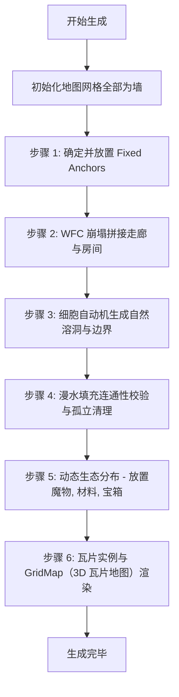

# 16 - 技术架构与代码设计 (Godot 4.x & GDScript 版)

> **架构换算说明（重要）**：本文档原始设计含 C# (Mono) 与格子回合制表述。当前决策为 **GDScript + 3D 实时 ARPG**（见 §0 决策表）。文中 `GlobalTurnManager` 已改为 `GameClock` 实时时钟；`Node2D / CharacterBody2D / Vector2 / CollisionShape2D` 等 2D 类型已统一改为 3D 等价类型；"网格移动 Tick"已改为实时移动逻辑。代码示例中的 C# 片段保留为接口/算法参考，落地时按 GDScript 或 C# 任选其一实现。
>


为了将《Dungeon Tavern》的系统玩法规范化，并为未来的程序开发与数据配置提供明确的落地指南，本技术规格书详细规划了游戏在 **Godot 4.x** 引擎下使用 **GDScript** 语言的代码架构、节点树设计、强类型数据类以及核心算法模块。

---

## 0. ✅ 设计决策变更记录

| 决策项 | 原方案 | 最终决策 | 原因 |
|-------|-------|---------|------|
| 开发语言 | C# (Mono) | **GDScript** | 迭代速度快，热重载原生支持 |
| 视觉风格 | 2D 像素俯视 (Stoneshard) | **3D 俯视角** | 复用现有 GLTF/OBJ 资产，降低资源制作成本 |
| NPC社交系统 | 全量实现 | **保留到后续版本** | Demo 阶段暂不开发，先验证核心循环 |

---

## 1. 核心运行架构与场景树设计

游戏运行流程由 Godot 的 **Scene Tree (场景树)** 与 **Autoload (全局单例)** 联合驱动，实现日夜周转的完全解耦。

### 1.1 场景管理器场景树 (GameRoot)
`TavernGameRoot (Node)` 作为全局场景管理器，负责调度游戏主状态机的切换。场景树结构如下：

```
TavernGameRoot (Node)
├── GlobalSaveManager (Autoload Mono Singleton)
├── GlobalPrestigeManager (Autoload Mono Singleton)
├── GameClock (Autoload Singleton)  // 实时时钟驱动（替代原回合制 GlobalTurnManager）
└── ActiveSceneContainer (Node)
    └── [运行时加载：ExplorationScene (Node3D) 或 TavernScene (Node3D)]
```

*   **日夜场景切换控制**：
    *   **白天探索**：卸载 `TavernScene`，实例化并挂载 `ExplorationScene`。玩家在野外进行实时移动与实时战斗。
    *   **晚上经营**：卸载 `ExplorationScene`，实例化并挂载 `TavernScene`。开启酒馆的营业状态机。
    *   **转场特写**：使用 `dave-style` 滤镜转场着色器 (Shader) 完成切屏。

### 1.2 全局单例 (Autoload Singletons)

项目使用 **GDScript Autoload** 模式注册全局单例。所有单例按功能域分组在 `globals/` 子目录下：

```
globals/
├── core/                     ← 核心基础设施
│   ├── game_state.gd          — GameState: 玩家状态、当前关卡
│   ├── game_events.gd         — GameEvents: 全局信号总线
│   ├── physics_setup.gd       — PhysicsSetup: 物理参数配置
│   ├── fx_helper.gd           — FxHelper: 视觉特效
│   ├── hit_stop_server.gd     — HitStopServer: 顿帧服务
│   ├── audio_manager.gd/tscn  — AudioManager: 音频播放
│   ├── localization_manager.gd — LocalizationManager: 本地化
│   └── service.gd             — Service: 类型安全的单例访问器
├── combat/                   ← 战斗系统
│   ├── combat_engine.gd       — CombatEngine: 战斗数值引擎
│   ├── combat_bridge.gd       — CombatBridge: 战斗桥接
│   ├── combat_hitbox_builder.gd — CombatHitboxBuilder: 判定盒构建
│   ├── combat_slash_animator.gd — CombatSlashAnimator: 斩击动画
│   ├── skill_runtime.gd       — SkillRuntime: 技能运行时
│   ├── skill_data.gd          — SkillData: 技能静态数据
│   ├── action_skills.gd       — ActionSkills: 动作技能定义
│   ├── skill_icons.gd         — SkillIcons: 技能图标
│   ├── momentum_context.gd    — MomentumContext: 动量上下文
│   ├── milestone_effects.gd   — MilestoneEffects: 里程碑被动
│   └── attr_panel.gd          — AttrPanel: 属性面板
├── tavern/                   ← 酒馆经营
│   ├── tavern_manager.gd      — TavernManager: 酒馆管理（日夜/金币/库存）
│   ├── tavern_settlement.gd   — TavernSettlement: 结算
│   ├── brewing_data.gd        — BrewingData: 酿酒数据中枢（单一数据源）
│   ├── fermentation_system.gd — FermentationSystem: 发酵系统
│   └── loot_table.gd          — LootTable: 战利品表
├── dungeon/                  ← 地下城探索
│   ├── dungeon_spawner.gd     — DungeonSpawner: 地牢生成
│   └── zone_manager.gd        — ZoneManager: 区域管理
└── equipment/                ← 装备系统
    ├── affix_system.gd        — AffixSystem: 词缀系统
    └── item_spawner.gd        — ItemSpawner: 物品生成
```

#### Service 访问器

为避免全项目泛滥的 `Engine.get_main_loop().root.get_node_or_null("XxxManager")` 模式，
提供类型安全的静态访问器 `Service`（位于 `globals/core/service.gd`）：

```gdscript
const Service := preload("res://globals/core/service.gd")

# 代替 var sr = Engine.get_main_loop().root.get_node_or_null("SkillRuntime")
var sr: Node = Service.skill_runtime()
var tm: Node = Service.tavern_manager()
var gs: Node = Service.game_state()
```

#### 数据流向（单一数据源原则）

```
BrewingData (策划案单一数据源)
  ├── MATERIALS_DB  (40种材料)
  ├── RECIPES_DB    (10种酒谱)
  └── FLAVOR_*      (16种口味)
       │
       ├──→ TavernManager.materials_db (只读兼容属性，委托给 BrewingData)
       ├──→ FermentationSystem (发酵逻辑)
       └──→ UI 脚本 (character_panel, equipment_detail_popup 等)
```

> **重要**：`TavernManager` 不再维护独立的材料/配方数据副本。
> 酿造逻辑已迁移至 `FermentationSystem`，`TavernManager` 仅负责日夜管理、金币、库存。

---

## 2. 强类型运行时数据模型 (Data Class Schema)

游戏数据结构分为静态数据（只读配置）与动态数据（运行时存档）。所有数据类均被设计为支持 Godot 的 JSON 序列化器或 `Newtonsoft.Json` 的纯 C# 类。

### 2.1 基础酿酒数据模型 (Brewing Keg)
```csharp
public class BrewingKeg
{
    public int KegId { get; set; }
    public int StartDay { get; set; }          // 投入材料的自然天数
    public List<string> MaterialIds { get; set; } = new(); // 投入的原材料 ID 列表
    public Dictionary<string, int> FermentedFlavor { get; set; } = new(); // 当前发酵累积的口味数据
    public int AgeDays { get; set; }           // 成熟后的陈酿天数 (0-3天上限)
    public bool IsReady { get; set; }          // 是否发酵完成 (隔天发酵 Ready = true)
    public string DecodedWineName { get; set; } // 酿造出的经典配方名称 (若不匹配则为“自定义混合酒”)
}
```

### 2.2 物品与装备数据模型 (Item & Equipment)
```csharp
public enum EquipmentSlot { MainHand, OffHand, Body, CargoHelper }
public enum Rarity { Common, Rare, Epic }

public class Item
{
    public string ItemId { get; set; }
    public string ItemName { get; set; }
    public int StackCount { get; set; }
}

public class Equipment : Item
{
    public EquipmentSlot Slot { get; set; }
    public Rarity ItemRarity { get; set; }
    public int Tier { get; set; }              // 装备阶数 (一阶/二阶/三阶)
    public string PositiveAffix { get; set; }  // 正向词缀 (可能为空)
    public string NegativeAffix { get; set; }  // 负向词缀 (可能为空)
    public int MaxDurability { get; set; }
    public int CurrentDurability { get; set; }
    public bool IsBroken => CurrentDurability <= 0;
}
```

---

## 3. 基于 Node-Component 组合的战斗实体设计

在野外探索场景中，为了避免庞大的继承体系，采用 Godot **Node-Component (组合优于继承)** 模式，并在 C# 中使用 **接口 (Interfaces)** 驱动强类型的战斗交互。

```
Player (CharacterBody3D)  <-- 实现 ICombatant, IDamageable 接口
├── MeshInstance3D（3D 网格渲染）
├── CollisionShape3D（碰撞体）
├── MovementComponent (Node，挂载实时移动逻辑)
├── CombatComponent (Node，挂载攻击命中/暴击结算)
└── ProficiencyComponent (Node，管理一至三阶装甲与武器熟练度)
```

### 3.1 核心战斗接口设计
```csharp
public interface IDamageable
{
    int CurrentHp { get; set; }
    int MaxHp { get; }
    void TakeDamage(DamageInfo damage);
}

public interface ICombatant
{
    int Strength { get; }
    int Agility { get; }
    int MagicPower { get; }
    int Constitution { get; }
    int EvadeRate { get; }
    Equipment GetEquippedItem(EquipmentSlot slot);
}

public struct DamageInfo
{
    public int RawDamage;
    public bool IsCritical;
    public Vector3 KnockbackForce;
    public Node3D Attacker;
}
```

---

## 4. 核心物理结算与算法模块

### 4.1 伤害加算与百分比对抗算法 (CombatCalculator.cs)
配合公式压缩，在战斗中消灭任何二次乘法乘数膨胀，公式完全采用 C# 的线性加算结构实现：

```csharp
public static class CombatCalculator
{
    // 计算命中率
    public static bool RollHitCheck(ICombatant attacker, ICombatant defender)
    {
        // 最终命中 = 基础(75%) + 攻方加成 - 防方闪避
        float baseHit = 75.0f;
        float attackerBonus = attacker.Strength * 0.5f; // 以近战为例
        float defenderEvade = defender.EvadeRate;
        
        float finalHitChance = Mathf.Clamp(baseHit + attackerBonus - defenderEvade, 5.0f, 95.0f);
        
        float roll = (float)GD.RandRange(0.0, 100.0);
        return roll <= finalHitChance;
    }

    // 计算线性伤害 (双手风格为例)
    public static DamageInfo CalculateMeleeDamage(ICombatant attacker, ICombatant defender)
    {
        DamageInfo info = new DamageInfo();
        Equipment weapon = attacker.GetEquippedItem(EquipmentSlot.MainHand);
        
        // 1. 物理伤害投骰 NdN + 伤害修正 (双手风格伤害修正)
        int diceDamage = RollDice(weapon); // 模拟 NdN 投骰
        float damageBonus = attacker.Strength * 1.5f; // 线性修正
        
        // 2. 最终伤害倍率 (线性加算，杜绝乘法膨胀)
        // 最终倍率 = 1.0 + 力量 * 0.015 + 熟练度 * 0.005
        float baseMultiplier = 1.0f;
        float strFactor = attacker.Strength * 0.015f;
        float profFactor = GetProficiencyLevel(attacker) * 0.005f;
        float finalMultiplier = baseMultiplier + strFactor + profFactor;
        
        float rawBaseDamage = (diceDamage + damageBonus) * finalMultiplier;
        
        // 3. 暴击对抗与减免结算
        info.IsCritical = RollCriticalCheck(attacker, defender);
        if (info.IsCritical)
        {
            float critMultiplier = 1.5f + (attacker.Agility * 0.01f);
            rawBaseDamage *= critMultiplier;
        }
        
        // 4. 防御力减免 (最终防御 = 防具 + 体质)
        int defenderDef = defender.Constitution + GetArmorDefense(defender);
        info.RawDamage = Mathf.Max(1, Mathf.RoundToInt(rawBaseDamage - defenderDef));
        
        return info;
    }
}
```

### 4.1.1 技能打断与动量上下文 (Skill Cancel & Momentum Context)

3D ARPG 动作系统需要在技能运行时维护一个轻量的 `MomentumContext`。它记录角色当前水平速度、加速度、上一技能类型、取消窗口状态和动量强度，用于计算“滑铲 + 踢击”“冲撞 + 战锤”等连段的伤害和击退强化。

```gdscript
class_name MomentumContext
extends RefCounted

var velocity: Vector3 = Vector3.ZERO
var acceleration: Vector3 = Vector3.ZERO
var direction: Vector3 = Vector3.ZERO
var source_skill_id: String = ""
var source_skill_type: String = ""
var strength: float = 0.0
var inherited_at_msec: int = 0

func compute_strength(next_direction: Vector3) -> float:
	var horizontal_velocity := Vector3(velocity.x, 0.0, velocity.z)
	var speed := horizontal_velocity.length()
	if speed <= 0.01:
		return 0.0
	var alignment := 1.0
	if next_direction.length() > 0.01:
		alignment = maxf(horizontal_velocity.normalized().dot(next_direction.normalized()), 0.0)
	return speed * alignment
```

技能运行时建议新增以下职责：

*   **取消判定**：`SkillRuntime.can_cancel(current_skill, next_skill, elapsed_sec)` 根据 `cancel_start`、`cancel_end`、`cancel_into` 判断是否允许打断。
*   **动量采样**：取消成功时，从玩家当前 `velocity`、上一帧速度差、当前朝向采样 `MomentumContext`。
*   **强化计算**：新技能结算前调用 `apply_momentum_to_attack(skill, momentum)`，把有效动量转为伤害、击退和位移距离加成。
*   **衰减与上限**：动量每次被消费后清空或强衰减；单次强化必须受 `momentum_cap` 限制。

推荐公式：

```gdscript
var effective_momentum := min(momentum.compute_strength(next_direction), skill.get("momentum_cap", 10.0))
var damage_bonus := effective_momentum * skill.get("momentum_damage_scale", 0.03)
var knockback_bonus := effective_momentum * skill.get("momentum_knockback_scale", 0.08)
attack.weapon_damage_mult *= 1.0 + damage_bonus
attack.knockback_force *= 1.0 + knockback_bonus
```

默认限制：

*   伤害强化默认上限为 `+30%`。
*   击退/位移强化默认上限为 `+80%`。
*   反向取消、撞墙取消、受击取消不提供完整动量奖励。
*   敌人也可以使用同一套 `MomentumContext`，但精英敌人的高动量技能必须有明显前摇和音效提示。

### 4.2 人类菜单标价偏离度评估 (PricingEvaluator.cs)
```csharp
public static class PricingEvaluator
{
    public struct PricingResult
    {
        public int GainedGold;
        public int PrestigePenalty;
        public int FavorIncrease;
    }

    public static PricingResult EvaluateHumanPrice(int basePrice, int menuPrice)
    {
        PricingResult result = new PricingResult();
        float deviation = (float)menuPrice / basePrice;

        if (deviation <= 1.0f) // 实惠付款
        {
            result.GainedGold = menuPrice;
            result.PrestigePenalty = 0;
            result.FavorIncrease = 1;
        }
        else if (deviation <= 1.3f) // 合理付款
        {
            result.GainedGold = menuPrice;
            result.PrestigePenalty = 0;
            result.FavorIncrease = 0;
        }
        else if (deviation <= 1.6f) // 昂贵抱怨
        {
            result.GainedGold = menuPrice;
            result.PrestigePenalty = -2;
            result.FavorIncrease = 0;
        }
        else // 暴利拒付 (摔杯子)
        {
            result.GainedGold = 0;
            result.PrestigePenalty = -15;
            result.FavorIncrease = 0;
        }

        return result;
    }
}
```

### 4.3 怪物亮铁片与装备折抵结算 (PlateExchanger.cs)
```csharp
public static class PlateExchanger
{
    public struct ExchangeResult
    {
        public int GainedGold;           // 系统后台折算的金币
        public Equipment BarteredItem;  // 怪物折抵留下的装备 (若触发)
        public int FavorIncrease;
    }

    public static ExchangeResult ExecuteMonsterExchange(int satisfactionDelta, int walletAmount, bool hasEquipment)
    {
        ExchangeResult result = new ExchangeResult();
        
        // 完全不合 (Delta 无达标) -> 获得 0 亮铁片，好感 -5
        if (satisfactionDelta < 0)
        {
            result.GainedGold = 0;
            result.FavorIncrease = -5;
            return result;
        }

        // 极佳/爆表折抵 (Delta >= 4)
        if (satisfactionDelta >= 4)
        {
            if (walletAmount > 0) // 类型 A：携带亮铁片
            {
                result.GainedGold = walletAmount; // 爽快交出所有亮铁片 (金币)
                result.FavorIncrease = 15;
            }
            else if (hasEquipment) // 类型 B：无亮铁片，携带装备
            {
                result.GainedGold = 0;
                result.BarteredItem = RollRandomEquipmentFromLootTable(); // 触发盲盒折抵
                result.FavorIncrease = 15;
            }
        }
        else // 一般温饱/喝爽
        {
            if (walletAmount > 0)
            {
                result.GainedGold = walletAmount;
                result.FavorIncrease = 10;
            }
            else
            {
                result.GainedGold = 0; // 无铁片，普通喝爽，装备不折抵
                result.FavorIncrease = 2;
            }
        }

        return result;
    }
}
```

### 4.4 WFC 随机房间生成古代钥匙约束器 (WfcMapGenerator.cs)
在随机关卡拼接时，WFC (波函数崩塌) 必须读取玩家的钥匙库存：

```csharp
public class WfcMapGenerator
{
    public void GenerateMap(PlayerInventory inventory)
    {
        bool hasVaultKey = inventory.ContainsItem("ForestVaultKey");
        
        List<WfcBlock> fixedAnchors = new List<WfcBlock>();
        
        if (hasVaultKey)
        {
            // 强行注入古代锁闭铁门/密封宝藏区地块，确保生成的地图有且仅有 1 个
            WfcBlock vaultRoom = GetVaultRoomTemplate();
            vaultRoom.SpawnRules = TileSpawnRules.ForcedOne;
            fixedAnchors.Add(vaultRoom);
        }
        
        // 执行常规波函数崩塌地块随机拼接算法...
        PerformWfcCollapse(fixedAnchors);
    }
}
```

---

## 5. JSON 运行时存档数据结构 (SaveData Schema)

玩家在酒馆睡去或死亡时执行序列化。JSON 格式保存采用扁平化的字段，以简化开发。

```json
{
  "GameProgress": {
    "CurrentDay": 12,
    "GlobalPrestigeLevel": {
      "Goblin": 320,
      "Minotaur": 110,
      "Ghost": 50,
      "Cyclops": 280,
      "Elf": 600
    },
    "TavernLevel": 4,
    "UnlockedRegularCustomers": ["Grum", "Barok", "Elen"],
    "ActiveStaffIds": ["ElfBrewer_01", "DwarfBlacksmith_01"]
  },
  "PlayerInventory": {
    "GoldCoins": 3450,
    "StashedMaterials": [
      { "ItemId": "Blackberry", "StackCount": 18 },
      { "ItemId": "BlueLightShroom", "StackCount": 5 }
    ],
    "EquippedItems": {
      "MainHand": {
        "ItemId": "SteelSword_Tier2",
        "PositiveAffix": "Sharp",
        "NegativeAffix": "",
        "CurrentDurability": 45,
        "MaxDurability": 50
      },
      "Body": {
        "ItemId": "LeatherArmor_Tier1",
        "PositiveAffix": "",
        "NegativeAffix": "Clunky",
        "CurrentDurability": 12,
        "MaxDurability": 30
      }
    }
  },
  "BrewingKegs": [
    {
      "KegId": 0,
      "StartDay": 11,
      "MaterialIds": ["Blackberry", "Blackberry", "BlueLightShroom"],
      "AgeDays": 0,
      "IsReady": true,
      "DecodedWineName": "亮莓果汁"
    }
  ]
}
```

---

## 6. 3D 视觉渲染管线与俯视视角配置

为了在 Godot 4.x 引擎中还原地下城探索与酒馆的不同氛围，整个渲染管线采取以下配置：

### 6.1 项目渲染参数配置
*   **渲染驱动**：rendering_device/driver.windows = "d3d12"
*   **渲染方式**：renderer/rendering_method = "gl_compatibility"
*   **纹理过滤**：textures/canvas_textures/default_texture_filter = 0

### 6.2 光照方案
*   **白天地牢**：DirectionalLight3D 方向光（冷色调）+ 环境光
*   **夜晚酒馆**：OmniLight3D 点光源（暖色调）+ Glow 后处理

### 6.3 俯视角相机
*   Camera3D 固定在角色上方俯视角度，视野 60-70 度

### 6.4 碰撞与导航
*   墙体 StaticBody3D + CollisionShape3D
*   导航 NavigationRegion3D
*   地图网格 3.0 米

### 6.5 场景组织

## 7. 运行时地形结构生成算法 (Terrain & Tile Generation)

地下城探索地图是由一个混合算法运行时随机生成的，该算法兼顾了**结构连通性约束**、**钥匙-铁门强制映射**以及**自然地貌的随机性**。

### 7.1 地形数据结构 (GridMapData)
在内存中，地图被抽象为一个 `GridMapData` 类：
```csharp
public enum TileType
{
    Empty,              // 未崩塌/虚无
    Floor,              // 可通行地板
    Wall,               // 不可通行墙体
    Door,               // 门（可通行，需交互）
    ExtractionShaft,    // 铁索升降井（撤离点）
    VaultGate,          // 锁闭铁门
    VaultChest,         // 密封宝藏箱
    Obstacle,           // 障碍物（不可通行，如石堆）
    Water,              // 水池/沼泽（减速或不可通行）
    SpikeHazard,        // 尖刺危险地形（Area3D 伤害体）
    AcidHazard,         // 酸液危险地形（Area3D 持续伤害体）
    PitHazard,          // 深坑/坠落危险地形
    HazardAnchor,       // 危险地形战斗锚点，用于房间生成约束
    KickLane            // 踢击/击退路线标记，不直接渲染为实体
}

public class GridMapData
{
    public int Width { get; }
    public int Height { get; }
    private TileType[,] _tiles;

    public GridMapData(int width, int height)
    {
        Width = width;
        Height = height;
        _tiles = new TileType[width, height];
        // 默认初始化为 Wall
        for (int x = 0; x < width; x++)
        {
            for (int y = 0; y < height; y++)
            {
                _tiles[x, y] = TileType.Wall;
            }
        }
    }

    public TileType GetTile(int x, int y) => _tiles[x, y];
    public void SetTile(int x, int y, TileType type) => _tiles[x, y] = type;
    public bool IsInBounds(int x, int y) => x >= 0 && x < Width && y >= 0 && y < Height;
}
```

### 7.2 生成算法管线与混合策略
地形生成器 `WfcMapGenerator` 运行时按照以下管线顺序构建地图数据：



1.  **步骤 1：固定锚点 (Fixed Anchors) 布局与钥匙约束**
    *   读取玩家背包以确认是否有区域钥匙（例如 `ForestVaultKey`）。
    *   如果有，强制在地图随机深处规划一个 `VaultGate` 房间。同时在地图随机区域分配 2 到 3 个物理撤离点 `ExtractionShaft`。
    *   这些房间被标记为“不可覆盖的固定锚点”，防止在接下来的随机崩塌中被破坏。
2.  **步骤 2：WFC (波函数崩塌) 地块拼接**
    *   通过一套地块模块（如 5x5 的小房间、L型弯道、T型三岔路、十字走廊）进行波函数崩塌。
    *   每个地块模块的边缘带有连接状态（如“北通”、“南不通”）。算法在未确定单元上迭代崩塌，直至所有地块拼接完毕。
3.  **步骤 3：细胞自动机 (Cellular Automata) 噪声平滑**
    *   对于自然形态的洞窟或林间空地，在房间拼接后，对墙体边缘运行细胞自动机（基于 B5678/S4567 规则进行 3-4 次迭代），让地图的墙体边界产生圆滑和不规则的自然洞穴感，摒弃直角方块。
4.  **步骤 4：连通性校验 (Connectivity Verification)**
    *   利用**漫水填充法 (Flood Fill)** 以玩家初始降落点（如入口营地）为中心进行遍历。
    *   检测所有已生成的 `Floor` 块是否可达。如果存在某些孤立的未连通区域，自动将其强行改写为 `Wall`，或者打通一条 2 米宽的连通走廊，确保玩家绝不会被困住。
5.  **步骤 5：生态分布与动态刷新 (Entity & Loot Spawn)**
    *   遍历可通行的 `Floor`。
    *   基于距离地图入口的远近配置不同的战力梯度（Ecology-Strength Filter）。
    *   以百分比概率分布刷新对应等级的怪物（如哥布林或怨灵）、酿酒材料（蓝莓、黑麦根等）以及采集灌木。

### 7.3 危险地形战斗锚点生成 (Hazard Anchor Generation)

3D ARPG 地牢生成器必须把地形伤害和物理位移作为核心空间玩法接入。尖刺、酸液、深坑等危险地形不应只在房间里随机撒点，而应以 `HazardAnchor` 为中心生成“可读、可利用、可反制”的战斗小结构。

1.  **HazardAnchor 放置阶段**
    *   在 WFC 房间确定后，为部分房间选择 0-2 个危险地形锚点。
    *   锚点类型由区域主题、深度、房间尺寸和奖励强度决定：森林少量尖刺，洞穴增加酸液和石柱，墓园/火山允许更高密度组合危险。
    *   锚点不得覆盖入口、撤离点、钥匙门、强制剧情点和宝箱交互落点。
2.  **KickLane 推导阶段**
    *   每个 `HazardAnchor` 至少尝试生成 1 条 `KickLane`，长度约 2-5 米，方向对齐房间主要通道或敌人巡逻路线。
    *   `KickLane` 上不能放置不可通行障碍；边缘可放置柱子、墙角、石堆，用于碰撞伤害和遮挡。
    *   若无法生成合法踢击路线，则降低该锚点权重或删除锚点，避免出现只能伤害玩家、无法被战术利用的陷阱。
3.  **敌人与奖励协同**
    *   普通敌人可生成在危险地形附近但不直接站在伤害体内。
    *   宝箱、高价值材料、精英敌人可提高危险锚点权重，形成风险奖励空间。
    *   高智敌人可附带 `avoid_hazard` 行为权重，低智敌人则更容易被玩家引诱或踢入危险区。
4.  **运行时实例化**
    *   `SpikeHazard` 映射到 `scenes/traps/spikes_trap.tscn`。
    *   `AcidHazard` 映射到 `scenes/traps/acid_trap.tscn`。
    *   `KickLane` 仅作为生成与调试标记，不生成可见实体；可在开发模式下显示为半透明线段用于审核地形可玩性。
5.  **校验规则**
    *   主路径连通性不得依赖玩家承受危险地形伤害。
    *   玩家进入危险房间前应至少能看见部分危险轮廓或听见提示音源。
    *   每个危险房间必须保留安全站位和绕行路线，确保地形伤害是战术机会，不是不可读惩罚。
