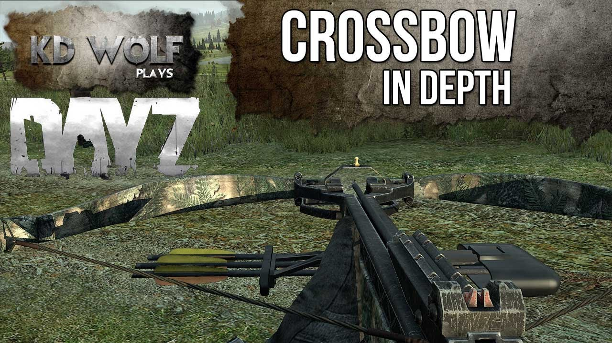
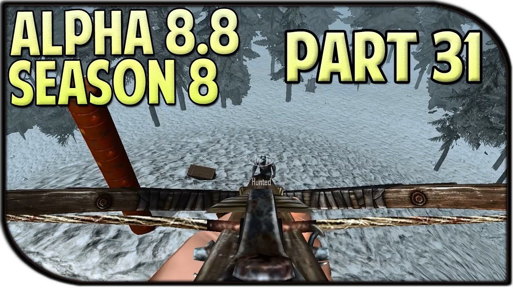
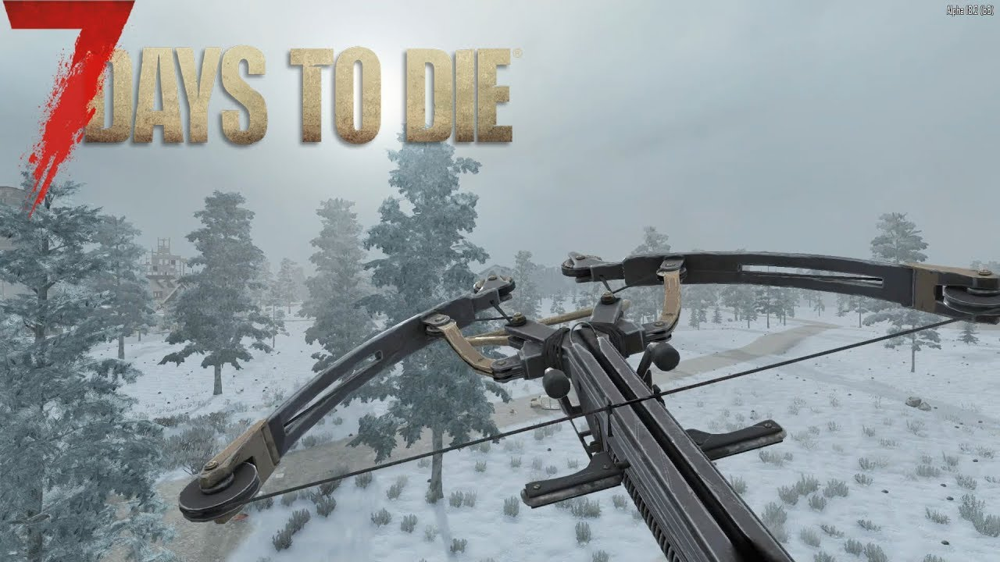
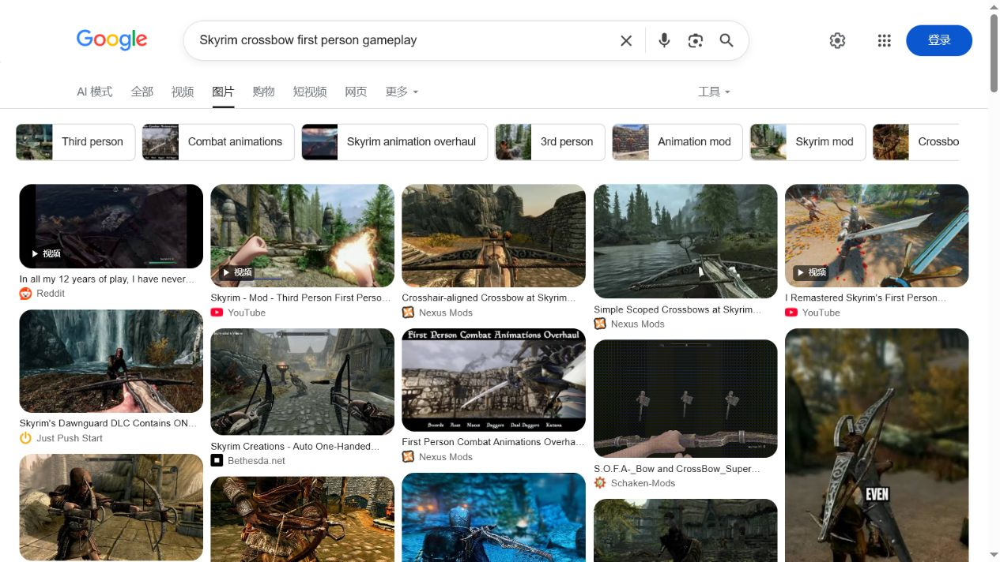
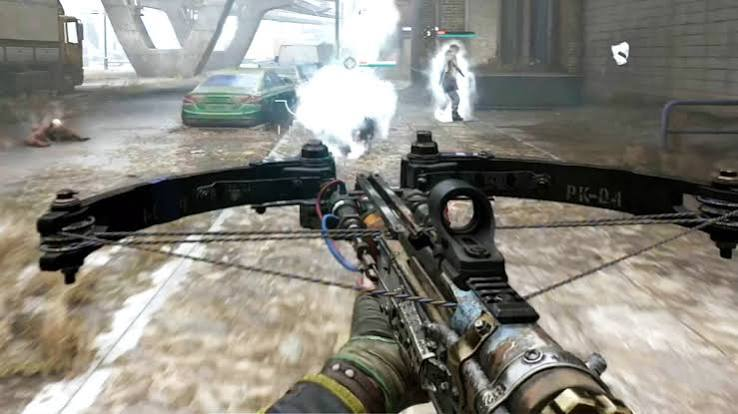
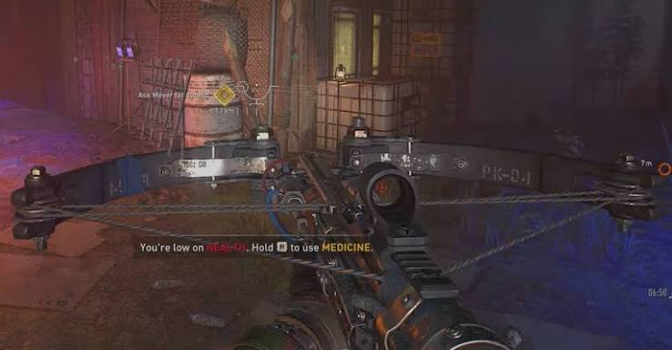
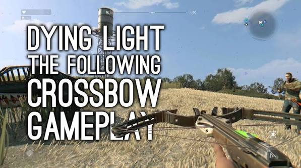
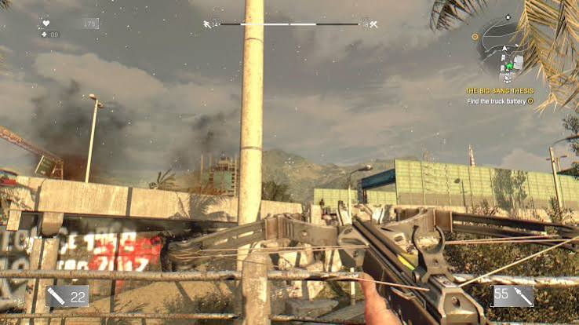

# First-Person Crossbow References

These images are research references only. They are not game assets and must not
be redistributed as Lantern Tavern content.

## Collected References

The original Dying Light captures remain useful for material density, but they
are not used as the pose target: that weapon presents a very forward support
grip and a wide modern limb assembly.

### DayZ

Source video: [DayZ Standalone Crossbow in Depth](https://www.youtube.com/watch?v=T9kbVKYiJKA)

Useful direction: the rear stock and trigger sit close to the player at the
bottom centre, while the limbs open across the lower-middle frame.

### 7 Days to Die

Source videos: [Crossbow too OP](https://www.youtube.com/watch?v=tgT3OC0wU6U) and
[The Crossbow](https://www.youtube.com/watch?v=EjT0hw10MCs)

Useful direction: keep the bolt rail and rear grip on the centre line; let the
limbs form a readable horizontal silhouette without pushing the support hand
too far toward the bow head.

### Skyrim / Dawnguard

Search capture: [Google Images - Skyrim crossbow first person gameplay](https://www.google.com/search?q=Skyrim+crossbow+first+person+gameplay&udm=2)

Useful source cards:

- [Crosshair-aligned Crossbow at Skyrim Special Edition](https://www.nexusmods.com/skyrimspecialedition/mods/42267)
- [Skyrim's Dawnguard DLC Contains ONE Crossbow](https://www.justpushstart.com/blog/2012/06/08/skyrim-dawnguard-dlc-contains-one-crossbow/)
- [First Person Combat Animations Overhaul](https://www.nexusmods.com/skyrim/mods/106348)

Observed direction: keep the sight/rail close to the screen center, reserve the
lower third for the weapon silhouette, and make the aiming state readable from
the weapon position rather than from a large arm swing. This is a secondary
reference for rail alignment, not the grip target.

### Dying Light

Search capture: [Google Images - Dying Light crossbow first person gameplay](https://www.google.com/search?q=Dying+Light+crossbow+first+person+gameplay&udm=2)

Useful source cards:

- [Dying Light 2: How To Get The Crossbow (& Bolts)](https://screenrant.com/dying-light-2-how-to-unlock-crossbow-bolts/)
- [PK Crossbow - Dying Light Wiki](https://dyinglight.wiki.gg/wiki/PK_Crossbow)
- [Dying Light The Following Crossbow Gameplay](https://www.youtube.com/watch?v=opdrietnBnI)

Observed direction: use a broad lower-frame limb silhouette, keep the central
rail/sight visible, and let fire/reload feedback move the weapon a short but
clear distance without losing the aiming lane. Its forward support grip is not
copied into Lantern Tavern.

## Lantern Tavern Acceptance Targets

- Rear grip and stock sit in the lower centre rather than at the bow head.
- Roll the crossbow 45 degrees around its body/Z axis so the gray limb
  assembly stays parallel to the screen horizontal axis while the body/rail
  points at the view centre and reticle. The camera itself stays unrolled.
- Limbs form a readable horizontal silhouette beneath the reticle.
- Crossbow remains large enough to read wood, steel, brass, and string at 640x360.
- Aim, fire recoil, and reload work produce visibly distinct captures.
- The first-person correction is camera-only; the shared `Hand.R` attachment,
  third-person placement, and single runtime weapon instance remain unchanged.
